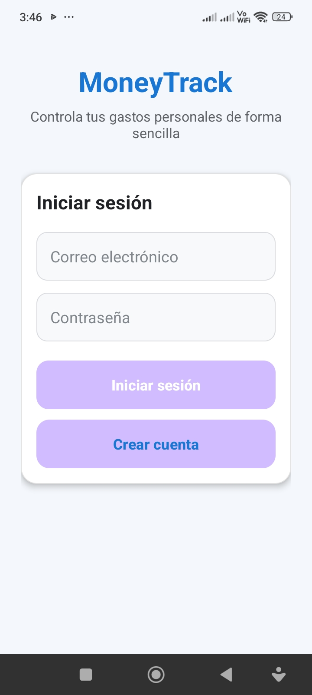
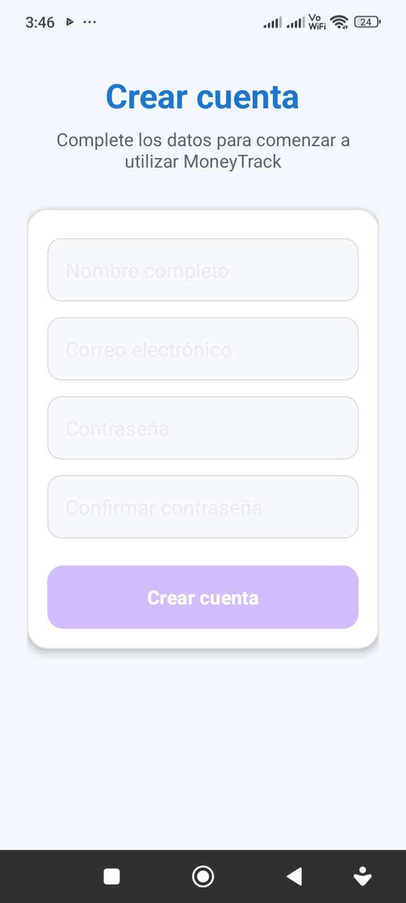
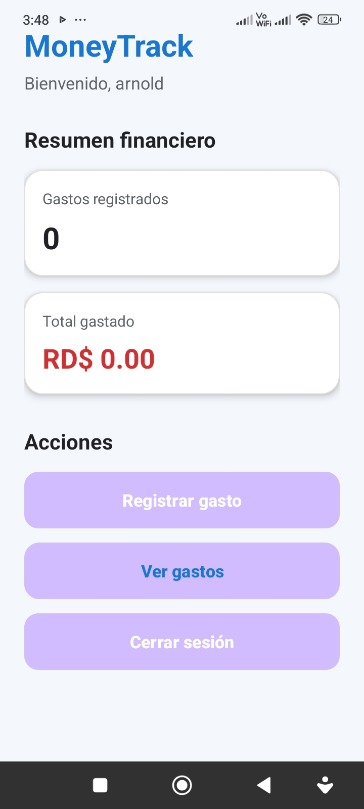
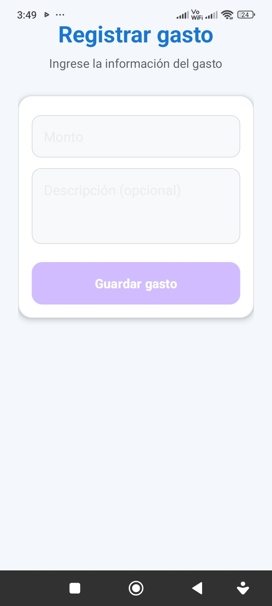
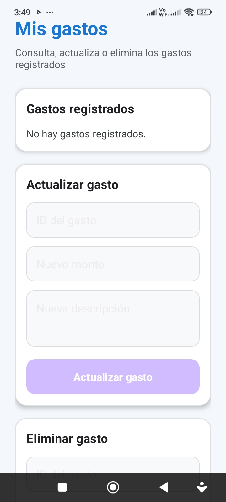

# MoneyTrack

## Descripción

**MoneyTrack** es una aplicación móvil desarrollada para dispositivos Android que permite registrar y administrar los gastos personales de forma sencilla y organizada. La aplicación utiliza una base de datos local SQLite para almacenar toda la información, por lo que funciona sin necesidad de conexión a Internet.

El proyecto fue desarrollado como Proyecto Práctico Final de la asignatura **Seminario de Proyecto II (ISW-411)** de la carrera de **Ingeniería de Software**.

---

## Características principales

- Registro de usuarios.
- Inicio de sesión con validación de credenciales.
- Dashboard con resumen financiero.
- Registro de gastos.
- Consulta de gastos registrados.
- Actualización de gastos.
- Eliminación de gastos.
- Almacenamiento local mediante SQLite.
- Funcionamiento sin conexión a Internet.

---

## Capturas de pantalla

### Inicio de sesión



---

### Registro de usuario



---

### Dashboard



---

### Registrar gasto



---

### Lista de gastos


---

## Tecnologías utilizadas

- Java
- Android Studio
- SQLite
- XML
- Git
- GitHub

---

## Arquitectura

El proyecto fue desarrollado utilizando el patrón de arquitectura **Modelo–Vista–Controlador (MVC)**.

- **Modelo:** SQLite y DatabaseHelper.
- **Vista:** Archivos XML de las interfaces.
- **Controlador:** Activities desarrolladas en Java.

---

## Requisitos

- Android 6.0 (API 23) o superior.
- Aproximadamente 20 MB de espacio disponible.
- No requiere conexión a Internet para su funcionamiento.

---

## Instalación

1. Descargue el archivo **MoneyTrack.apk** ubicado en la carpeta `apk`.
2. Transfiera el archivo al dispositivo Android.
3. Instale la aplicación.
4. Si Android lo solicita, habilite temporalmente la instalación desde orígenes desconocidos.
5. Abra MoneyTrack y cree una cuenta de usuario.

---

## Estructura del proyecto

```text
MoneyTrack
│
├── app
├── apk
├── gradle
├── README.md
└── settings.gradle.kts
```

---

## APK

La versión compilada de la aplicación se encuentra en:

```text
apk/MoneyTrack.apk
```

---

## Autor

**Arnold Mejía Tineo**

Ingeniería de Software

Universidad Abierta para Adultos (UAPA)

Proyecto Práctico Final – Seminario de Proyecto II (ISW-411)

2026
